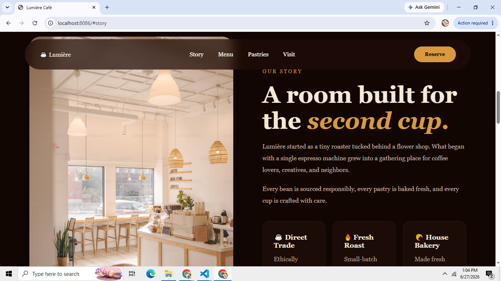
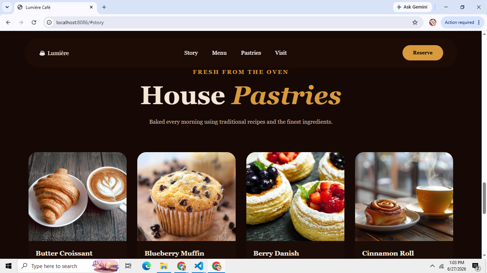
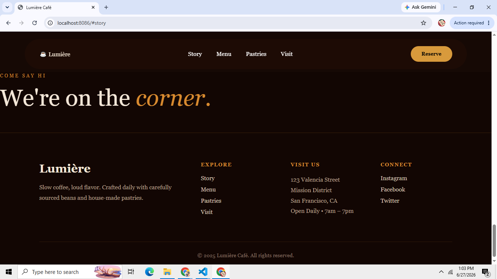

A full-stack coffee café web application built using Spring Boot (MVC architecture), HTML, CSS, and JavaScript with dynamic server-rendered pages.

## 📸 Coffee Café Website Screenshots

### 🏠 Top Section (Hero / Display)

### 📖 Story Section

### ☕ Menu Section

### 🥐 Pastries Section

### 🔻 Footer Section

